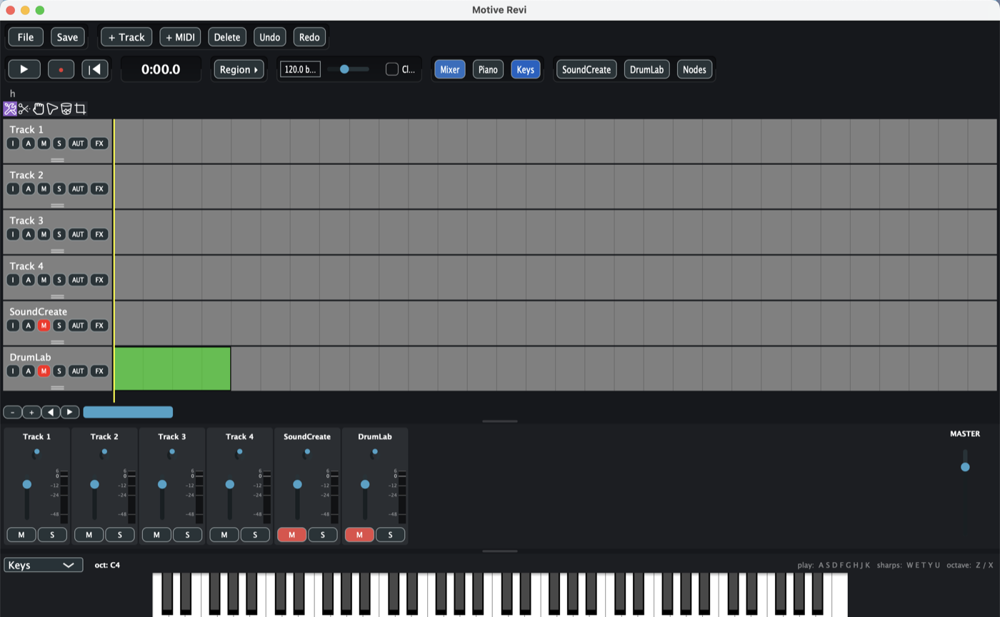
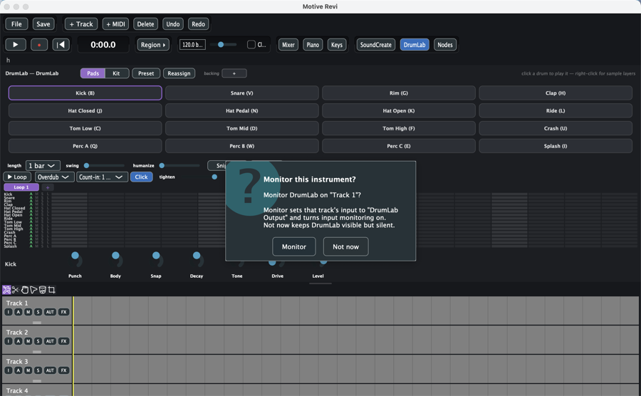
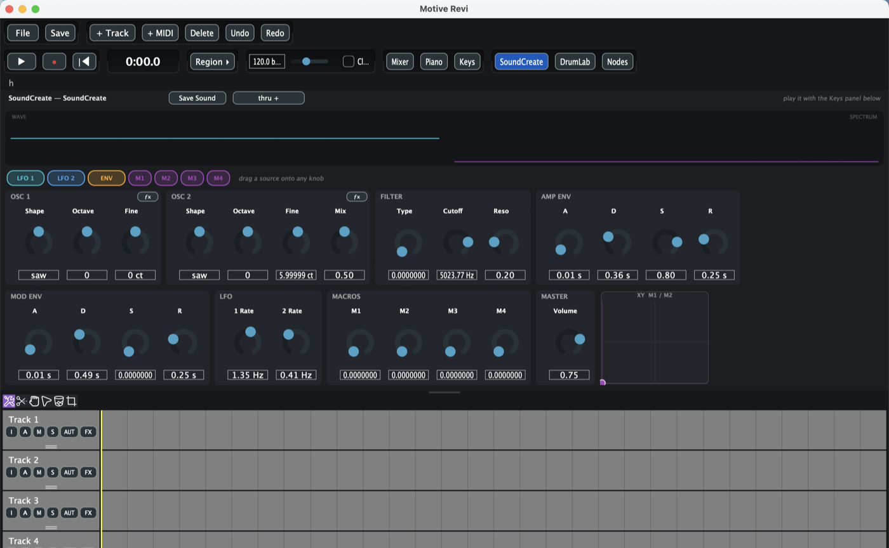
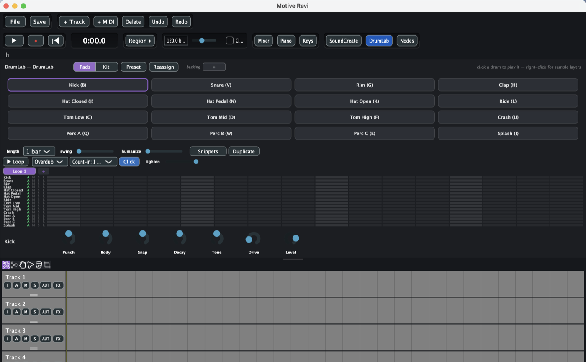
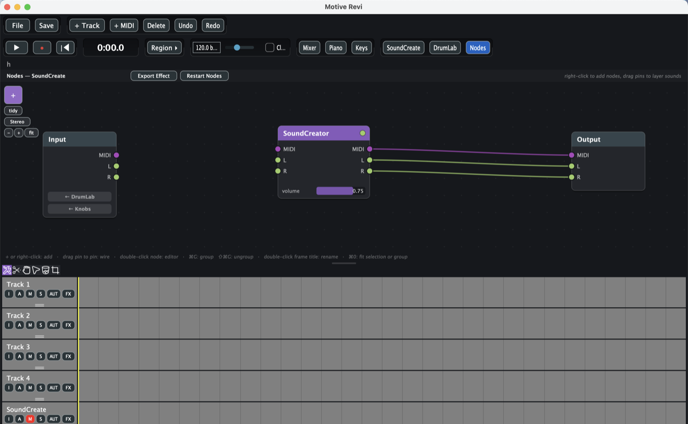

# Motive Revi

A lean, fast DAW for macOS — timeline, piano roll, mixer, drum machine, synth
designer, node-based effect routing, VST3 hosting, and LAN collaboration.

**[⬇ Download the latest build](../../releases)** — or grab
`Motive Revi.app` directly from this repository.

---

## Contents

- [Installing](#installing)
- [Quick start](#quick-start)
- [The window at a glance](#the-window-at-a-glance)
- [Toolbar — row 1](#toolbar--row-1-project--editing)
- [Toolbar — row 2](#toolbar--row-2-transport--panels)
- [The tool row](#the-tool-row)
- [Track headers](#track-headers)
- [The timeline](#the-timeline)
- [Mixer](#mixer)
- [Keys — the play keyboard](#keys--the-play-keyboard)
- [Piano roll](#piano-roll)
- [SoundCreate](#soundcreate--the-synth-designer)
- [DrumLab](#drumlab--the-drum-machine)
- [Nodes](#nodes--the-patching-canvas)
- [The File menu](#the-file-menu)
- [Rooms — collaborating](#rooms--collaborating)
- [Audio & MIDI setup](#audio--midi-setup)
- [Keyboard shortcuts](#keyboard-shortcuts)
- [Where your files live](#where-your-files-live)

---

## Installing

1. Download `Motive Revi.app`.
2. Drag it to your **Applications** folder.
3. **First launch:** right-click the app and choose **Open**, then confirm.

> **Why the extra step?** The app isn't signed with an Apple Developer
> certificate, so macOS blocks it on a normal double-click with *"cannot be
> opened because the developer cannot be verified."* Right-click → Open tells
> macOS you trust it. You only have to do this once.
>
> If macOS still refuses, run this once in Terminal:
> ```bash
> xattr -dr com.apple.quarantine "/Applications/Motive Revi.app"
> ```

**Microphone access.** On first launch macOS asks for microphone permission —
this is what lets the app record from your audio interface or mic. If you
decline, everything else still works (playback, MIDI recording, the transport).
To grant it later: System Settings → Privacy & Security → Microphone, then
reopen **File → Audio Devices** or restart the app.

**Requirements:** macOS 14 (Sonoma) or later, on Apple Silicon (M1 or newer).
Intel Macs are not supported by this build.

---

## Quick start

Sixty seconds to your first sound.

1. **Launch the app.** A project picker appears — click **Skip (scratch
   session)** to just start playing, or type a name and hit **New Project**.
2. **Click `DrumLab`** in the toolbar. A 4×4 grid of drum pads appears.
3. If it asks *"Monitor this instrument?"*, click **Monitor** — that routes the
   drums to a track so you can hear them.
4. **Click any pad** (or press its letter — `B` for kick, `V` for snare) to
   hear it.
5. **Click squares in the step grid** below the pads to build a beat.
6. **Press Space** to play.

To play a melody instead: click **`Keys`**, then play your computer keyboard —
`A S D F G H J K` are the white notes.

---

## The window at a glance



From top to bottom:

| Area | What it is |
|---|---|
| **Toolbar (2 rows)** | Project actions, transport, and the panel toggles |
| **Project name** | The current project, shown just under the toolbar |
| **Tool row** | Six icons that change what clicking on the timeline does |
| **Track headers** (left) | One per track — name, arm, mute, solo, input, FX |
| **Timeline** (right) | Your arrangement: clips laid out over time |
| **Zoom / scroll bar** | Under the timeline |
| **Panels** (bottom) | Mixer, Piano roll, Keys, SoundCreate, DrumLab, Nodes |

The panels stack at the bottom and are toggled from the toolbar. **You can drag
the thin horizontal grip between any two panels to resize them.**

---

## Toolbar — row 1 (project & editing)

| Button | What it does |
|---|---|
| **File** | Opens the main menu — new/open/save, export, devices, plugin scanning, Rooms. [Detailed below.](#the-file-menu) |
| **Save** | Saves the current project immediately. |
| **+ Track** | Adds a new, empty track at the bottom. |
| **+ MIDI** | Creates an empty MIDI clip on the selected track, ready to draw notes into. |
| **Delete** | Deletes whatever is selected — a clip, or a whole track. |
| **Undo** | Steps backward through your edits. |
| **Redo** | Steps forward again. |

Undo covers essentially everything: adding tracks, moving clips, changing
knobs, editing drum steps.

---

## Toolbar — row 2 (transport & panels)

### Transport

| Button | What it does |
|---|---|
| **▶** | Play / pause. **Space does the same thing.** |
| **●** | Record. Arms and starts recording on any track whose **A** button is lit. |
| **⏮** | Return to zero — jumps the playhead back to the start. |
| **0:00.0** | The live position readout. |

**How the playhead works — this is worth understanding.** Motive Revi uses an
*anchored* playhead. When you press play, a solid yellow line stays where you
started, and a faint line sweeps along showing where you are now. When you stop,
you snap back to the anchor rather than wherever you happened to stop. Click
anywhere on the timeline to move the anchor.

There is deliberately **no separate Stop button** — play/space pauses back to
the anchor, and pressing Record again stops recording and keeps the take.

### Region

**Region ▸** expands into four more buttons:

| Button | What it does |
|---|---|
| **In** | Sets the loop start to the playhead. |
| **Out** | Sets the loop end to the playhead. |
| **Loop** | Turns looping on/off between In and Out. |
| **Punch** | Restricts recording to the In–Out range only. |

### Tempo & click

- **The number field** (e.g. `120.0 bpm`) — your project tempo. Drag it or type.
- **The slider** next to it — the same tempo, as a drag.
- **Click** — the metronome on/off.

### Panel toggles

The right-hand group opens and closes the bottom panels:

| Button | Opens |
|---|---|
| **Mixer** | Faders, pans and meters for every track |
| **Piano** | The piano roll, for editing MIDI notes |
| **Keys** | The on-screen play keyboard |
| **SoundCreate** | The synth designer |
| **DrumLab** | The drum machine |
| **Nodes** | The patching canvas |

Three rules about these:

- **SoundCreate and DrumLab share one dock — only one can be open.** Opening
  one closes the other.
- **Keys and DrumLab are both "playable instruments," so opening one closes the
  other.**
- **Nodes is independent** and opens alongside anything else.

> **If a button suddenly seems dead, look for a prompt.** Opening DrumLab or
> SoundCreate can raise a **"Monitor this instrument?"** dialog. Until you
> answer it, clicks elsewhere in the app don't register — so a toolbar button
> that appears to do nothing usually means this prompt is waiting behind or
> below what you're looking at. Answer it and everything responds again.
>
> 
>
> **Monitor** routes the instrument to that track so you can hear it, and is
> what you normally want. **Not now** keeps the panel open but silent.

---

## The tool row

Six icons under the project name. They change what a click on the timeline
does.

| Tool | What it does |
|---|---|
| **Mouse** | The everyday tool. Drag a clip to move it, drag near either end to trim it, and clicking also drops the playhead where you clicked. |
| **Cut** | Click a clip to split it at that point. The pointer becomes a crosshair. |
| **Move** | Drags clips only — no edge trimming, and clicking doesn't move the playhead. Use this when you want to reposition clips without any risk of trimming one by accident. |
| **Cursor** | Click anywhere to place the playhead. The pointer becomes an I-beam. Clips can't be moved with this tool. |
| **Trash** | Click a clip to delete it. |
| **Crop** | Trimming from anywhere on the clip, not just the ends — the left half trims the start, the right half trims the end. |

---

## Track headers

Every track has a header on the left of the timeline:

```
Track 1
[I] [A] [M] [S] [AUT] [FX]
─────  ← drag this grip to change the track's height
```

| Button | What it does |
|---|---|
| **I** | **Input menu.** Choose what this track listens to — an audio input, a MIDI device, the play keyboard, or an internal source (see below). Input Monitoring also lives here. |
| **A** | **Arm.** Lights red. Armed tracks record when you hit ● and receive played notes. |
| **M** | **Mute.** Silences this track. |
| **S** | **Solo.** Silences every *other* track. |
| **AUT** | **Automation lanes.** Show/hide a lane under the track for Volume, Pan, or Script param 1. Draw points on the lane to automate over time. |
| **FX** | **Effects.** Add plugins to this track's chain; each one gets Open Editor / Bypassed / Remove. |

**Double-click the track name to rename it.** Drag the small grip under the
buttons to make the track taller or shorter.

### Track inputs, explained

The **I** menu lists four kinds of source:

1. **Input 1, Input 2, …** — audio channels from your interface, as mono
   channels or stereo pairs.
2. **Motive Keys / SoundCreate** — the on-screen keyboard and the sound you're
   designing.
3. **Your MIDI devices** — anything you ticked in File → Audio Devices.
4. **Internal taps** — **Node Output**, **DrumLab Output**, **SoundCreate
   Output**. These let one track listen to another panel's audio, so you can
   record your drums or your synth onto a normal track.

**Input Monitoring** (also in the I menu) passes the input through to your
speakers without recording. For internal taps it works immediately; for live
microphone or interface audio it only works while the track is armed, which
avoids accidental feedback.

The header shows a live level bar while armed, and a red dot with a tooltip if
the input you picked has been unplugged.

---

## The timeline

- **Click anywhere** to move the playhead there.
- **Drag a clip** to move it; drag it onto another track to move it there.
- **Drag a clip's left or right edge** to trim it.
- **Double-click a clip** to open its inspector.
- **The `−` `+` buttons** under the timeline zoom in and out.
- **The `◀` `▶` buttons** scroll left and right.
- **The blue bar** is a scrollbar — drag it to move through the project.
- **Two-finger scroll** moves vertically through tracks; **two-finger sideways**
  pans through time.

The timeline is a fixed 10 minutes long, showing about one minute at a time by
default.

---

## Mixer

One strip per track, plus a **MASTER** strip on the right.

| Control | What it does |
|---|---|
| **The small dot at the top** | Pan — drag left/right to place the track in the stereo field. |
| **The vertical fader** | Volume, marked in decibels (6, 0, −12, −24, −48). |
| **The bar beside the fader** | The live level meter. |
| **M** | Mute (same as the track header). |
| **S** | Solo (same as the track header). |

---

## Keys — the play keyboard

An on-screen keyboard spanning C1–C7 that you can play with your mouse **or
your computer keyboard**.

- **The dropdown on the left** switches between **Keys**, **Drums** and
  **Pads** layouts.
- **`oct: C4`** shows the current octave.
- **Play:** `A S D F G H J K` — the white notes.
- **Sharps:** `W E T Y U` — the black notes.
- **Octave:** `Z` down, `X` up.

Whatever you play goes to the armed or selected track. If SoundCreate is open,
it plays the sound you're designing; closing SoundCreate hands control back to
whatever the keyboard was aimed at before.

---

## Piano roll

Opens with **Piano**. Select a MIDI clip on the timeline (or click **+ MIDI** to
make one) and its notes appear here.

- **Click** on empty space to add a note.
- **Drag** a note to move it; **drag its edge** to change its length.
- **Full Screen** (top right) expands the piano roll over the whole window.

> **One thing to know:** notes in a *DrumLab pattern clip* are regenerated from
> the drum grid. If you edit those notes here, your edits will be overwritten
> the next time you touch the grid. Edit drum patterns in DrumLab, and use the
> piano roll for ordinary MIDI clips.

---

## SoundCreate — the synth designer



A two-oscillator synth with a drag-and-drop modulation system. Play it with the
Keys panel.

**Top bar:** **Save Sound** stores your patch; **thru +** loads an audio file
and loops it through the sound you're designing so you can hear it in context
(audition only — it never ends up in an export).

**Displays:** **WAVE** shows the waveform, **SPECTRUM** shows the frequency
content.

### The sections

| Section | Controls |
|---|---|
| **OSC 1** | Shape (saw, square, …), Octave, Fine tune. The small **fx** button adds effects to this oscillator alone. |
| **OSC 2** | Shape, Octave, Fine, and **Mix** — the balance between the two oscillators. |
| **FILTER** | Type, Cutoff (which frequencies pass), Reso (emphasis at the cutoff). |
| **AMP ENV** | A D S R — how the volume evolves: Attack, Decay, Sustain, Release. |
| **MOD ENV** | A second A D S R you can point at anything else. |
| **LFO** | 1 Rate and 2 Rate — two low-frequency oscillators for wobble and vibrato. |
| **MACROS** | M1–M4 — four knobs you can wire to several things at once. |
| **MASTER** | Overall volume. |
| **XY M1 / M2** | A pad — drag the dot to sweep two macros at once. |

### Modulation: drag a source onto any knob

The chips along the top — **LFO 1**, **LFO 2**, **ENV**, **M1**–**M4** — are
modulation *sources*. **Drag a chip onto any knob** and that source starts
moving it. This is how you get filter sweeps, vibrato, and macro control.

---

## DrumLab — the drum machine



Sixteen synthesised drums with a step sequencer.

**Top bar:** **Pads / Kit** switches between playing pads and editing the kit ·
**Preset** loads and saves kits · **Reassign** remaps pads · **backing +** loads
a track to play along to (audition only, never exported).

### The pads

A 4×4 grid, each with a keyboard shortcut:

| | | | |
|---|---|---|---|
| Kick **(B)** | Snare **(V)** | Rim **(G)** | Clap **(H)** |
| Hat Closed **(J)** | Hat Pedal **(N)** | Hat Open **(K)** | Ride **(L)** |
| Tom Low **(C)** | Tom Mid **(D)** | Tom High **(F)** | Crash **(U)** |
| Perc A **(Q)** | Perc B **(W)** | Perc C **(E)** | Splash **(I)** |

**Click a pad to play it. Right-click for sample layers.** Clicking a pad also
selects it, so the knob row at the bottom (**Punch, Body, Snap, Decay, Tone,
Drive, Level**) applies to that drum.

### The step grid

Each of the 16 drums gets a row. Click a square to place a hit, click again to
remove it. Each row has four small buttons:

| | Meaning |
|---|---|
| **A** | Accent — hit harder |
| **M** | Mute this row |
| **S** | Solo this row |
| **L** | Lock this row against changes |

### Pattern controls

| Control | What it does |
|---|---|
| **length** | Pattern length — 1, 2 or 4 bars. |
| **swing** | Pushes off-beats later for a shuffled feel. |
| **humanize** | Randomises timing very slightly so it feels less rigid. |
| **▶ Loop** | Auditions the pattern from the top, with the backing track. |
| **Click** | The metronome, for this panel. |
| **Snippets** | Save the current pattern to your library, or drop a saved one in. |
| **Duplicate** | Copies the current pattern into a new tab. |
| **Loop 1 / +** | Pattern tabs — build several patterns and switch between them. |

Your pattern becomes a normal looping MIDI clip on the timeline, so you can move
and arrange it like anything else.

**To record your drums as audio:** add another track, set its input to
**DrumLab Output**, arm it, and hit record.

---

## Nodes — the patching canvas



A free-form canvas where you wire sound sources and effects together by hand.
Opens with **Nodes**, in its own dock.

**Top bar:** **Export Effect** turns your whole graph into a single reusable
effect · **Restart Nodes** restarts the audio graph cleanly.

**Left-hand controls:** **+** adds a node · **tidy** auto-arranges the layout ·
**Stereo** toggles stereo/mono · **− + fit** zoom out, in, and fit-to-window.

### Reading the canvas

Nodes are boxes with **pins** on the sides. **Drag from one pin to another to
wire them together.**

- **Purple wires carry MIDI** (notes).
- **Green wires carry audio.**

A new graph starts with three nodes: **Input** (what comes in), your instrument
in the middle, and **Output** (what goes out).

The **Input** node has two chips — **← DrumLab** and **← Knobs** — which pull
live audio from those panels into the graph. **Only one can be on at a time;**
enabling one turns the other off. To combine sources, use a **Merge** node.

### Canvas shortcuts

These are also printed along the bottom of the canvas:

| Action | How |
|---|---|
| Add a node | **+** button, or **right-click** the canvas |
| Wire two nodes | **Drag from pin to pin** |
| Open a node's editor | **Double-click** the node |
| Group selected nodes | **⌘G** |
| Ungroup | **⇧⌘G** |
| Rename a group | **Double-click its title** |
| Fit selection or group to view | **⌘0** |

Groups are named frames that never overlap. Dragging a group moves the whole
frame; dragging a frame's border resizes it.

---

## Effects and instruments

Add these from any track's **FX** button. Each one you add gets **Open
Editor**, **Bypassed** and **Remove** in the same menu.

| Built-in | What it is |
|---|---|
| **MotiveSynth** | The SoundCreate synth, as a plugin you can place anywhere. |
| **DrumKit** | The DrumLab kit, as a plugin. |
| **Sampler** | Plays back an audio file as an instrument. |
| **MotiveScript** | A programmable effect — [see below](#motivescript). |
| **Sound Graph** | A whole node graph packaged as a single plugin. This is what NodeView edits. |
| **Convolution** | Convolution reverb — load an impulse response to place your sound in a real space. |
| **Band Split** | Splits the signal into frequency bands so you can process them separately. |
| **M/S Split** / **M/S Merge** | Splits into mid and side (centre vs. stereo width), and merges back. |
| **Loop** | Repeats whatever feeds it. |

**VST3 plugins** you've scanned appear in the same menu. Scan them with
File → *Scan for VST3 Plugins* (standard locations) or *Scan VST3 Folder…*
(a folder you pick).

---

## MotiveScript

A small programming language built into the app for writing your own audio
effects. If you don't want to write code, you can ignore this entirely — but
the factory library of ready-made effects is worth a look.

**To use it:** add **MotiveScript** from a track's **FX** menu, then
double-click it to open the editor.

In the editor you get:

- A **code editor** that recompiles as you type, with errors reported by line
  number underneath.
- A **library dropdown** ("Open saved effect…") holding the factory effects and
  anything you've saved.
- **Tabs**, so you can work on several scripts at once.

Scripts run per sample, which means you can write things that aren't possible
by wiring existing effects together.

Two related features:

- **Automation:** a track's **AUT** menu exposes *Script param 1*, so you can
  automate a script parameter over time from the timeline.
- **Export Effect** in NodeView turns an entire node graph into a single
  MotiveScript effect, which is a good way to see how a patch translates into
  code.

---

## The File menu

| Item | What it does |
|---|---|
| **New Project…** | Starts a fresh project. |
| **Open Project…** | Opens a `.motive` file. |
| **Projects…** | The project picker you see at launch. |
| **Save** | Saves the current project. |
| **Render Mixdown…** | Exports your whole mix to an audio file. |
| **Bounce Track in Place** | Renders one track to audio and replaces it — good for freezing a heavy plugin chain. |
| **Rooms (collaborate)…** | Host or join a Room. [See below.](#rooms--collaborating) |
| **Scan for VST3 Plugins** | Finds plugins in the standard system locations. |
| **Scan VST3 Folder…** | Scans a folder you choose. |
| **Audio Devices…** | The audio and MIDI setup panel. |

When you're in a Room, **Render Mixdown** is replaced by two options:
**Export: Only Me** (renders to your machine) and **Export: Everyone** (renders
and pushes the file to every person in the Room).

Muted tracks are excluded from exports entirely, and if anything is soloed, only
the soloed tracks are exported.

---

## Rooms — collaborating

Rooms lets several people on the same network work on one shared project.

**To host:** File → Rooms → **Host This Project as a Room…**, optionally set a
password.

**To join:** File → Rooms, and pick a Room from the list of those found on your
network. There's a direct-address option if discovery doesn't find it.

How it behaves:

- Everyone's edits are merged automatically. If two people edit at once, the
  host decides the order and everyone converges.
- **Only one person can record at a time.** Someone starting a recording stops
  playback for everyone and takes an exclusive lock until their take is
  finished and everyone has it.
- Audio files transfer automatically and are verified by checksum.
- You'll see what other people are doing in the status line.
- **Live audio is never streamed** — Rooms shares the project, not the sound.
  Everyone hears their own machine.

---

## Audio & MIDI setup

**File → Audio Devices** opens the device panel.

- **Output** — any CoreAudio output (speakers, headphones, interface) and which
  of its channels to use.
- **Input** — any CoreAudio input (built-in or USB mic, audio interface) and its
  channels. What you enable here is what track input menus offer.
- **MIDI inputs** — tick the keyboards and controllers you want live. Newly
  plugged-in devices are enabled automatically the first time they appear.
- **Sample rate and buffer size** are chosen for you (your device's native
  rate, ~256-sample buffer ≈ 5 ms). To change them, use the **Advanced**
  button; your choice is respected from then on.

Preferences restore on launch. If a saved device is missing, the app falls back
to the system default — or to output-only if input access was denied — rather
than failing to start.

---

## Keyboard shortcuts

| Key | Action |
|---|---|
| **Space** | Play / pause (returns to the anchor) |
| **A S D F G H J K** | Play white notes (Keys panel) |
| **W E T Y U** | Play black notes (Keys panel) |
| **Z / X** | Octave down / up |
| **B V G H J N K L C D F U Q W E I** | Trigger drum pads (DrumLab) |
| **⌘G** | Group selected nodes (Nodes) |
| **⇧⌘G** | Ungroup (Nodes) |
| **⌘0** | Fit selection to view (Nodes) |
| **Double-click** | Rename a track · open a clip's inspector · open a node's editor |

---

## Where your files live

| What | Where |
|---|---|
| Projects | `~/Documents/Motive Revi Projects` |
| Preferences | `~/Library/Motive Revi/` |
| Rooms (shared projects) | `/Users/Shared/Motive Revi Rooms` |

Your whole workspace — which panels were open, what they were pointed at, your
loop region, zoom and tool — is saved with each project and restored when you
open it.

---

## Windows

A Windows build exists and is maintained alongside the macOS one, but isn't
distributed here yet. Get in touch if you want it.

---

## Source code

This repository distributes the built application. The source isn't public —
if you'd like to talk about the code, the architecture, or a collaboration,
**contact me directly** and I'm happy to.

---

## Reporting a problem

Open an issue with:

- what you were doing when it happened
- your macOS version and Mac model
- your audio interface, if one was connected

Crash logs help a lot: **Console.app → Crash Reports**, look for
`Motive Revi`.
